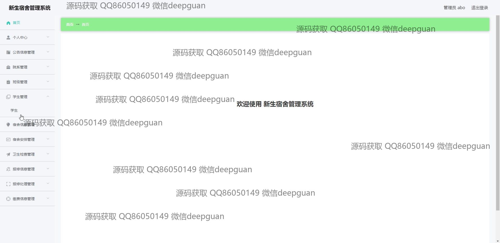

<h1 align="center">的新生宿舍管理系统</h1>

## 简介
新生宿舍管理系统：基于Spring Boot开发，角色分为管理员和学生；功能包括学生管理、宿舍安排、卫生检查、报修管理、缴费信息管理，旨在提高宿舍管理效率和用户体验。    --计算机毕业设计源码；毕设源码；java毕业设计源码

## 联系方式

<h3 align="center">获取完整代码与数据库文件 + 微信：deepguan QQ: 86050149 QQ群: 783742310</h3>

<h3 align="center">可帮忙远程部署 包运行成功！提供远程部署、修改代码、设计文档指导、代码讲解等服务！</h3>

## 功能介绍（完整见运行截图）
管理员： 基本功能包括登录、注册和退出。系统界面简洁，主要模块涵盖个人中心、公告信息管理、院系管理、班级管理、学生管理、宿舍信息管理、宿舍安排、卫生检查、报修管理及缴费信息管理。管理员能够进行学生信息录入及修改，操作宿舍信息，管理公寓和卫生检查记录，处理维修申报，管理缴费信息并生成相应报表，权限管理确保不同用户角色的访问控制。

学生： 能够注册、登录系统，并修改个人信息。可以查看公告、院系及班级信息，以及分配给自己的宿舍信息，提交对宿舍的维修申请，查看和提交维护费用，了解检查结果，确保卫生情况符合标准。角色权限设置确保学生只能访问和操作与其身份相对应的模块，保障了信息的安全和系统运行的规范性。

## 运行截图

本代码来源于网络,仅供学习参考使用!

